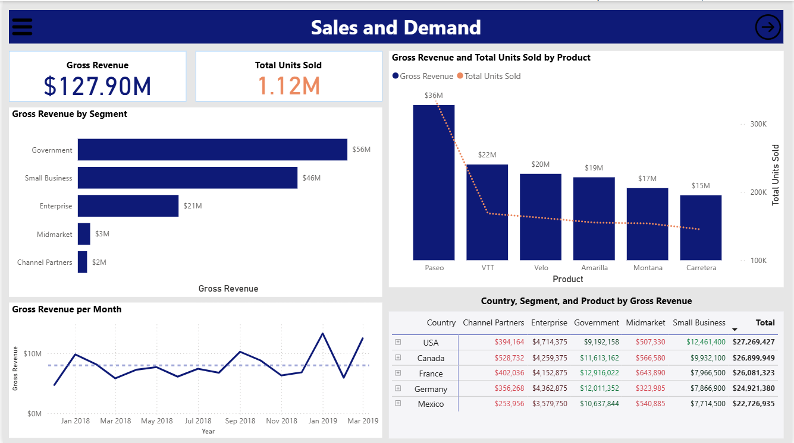
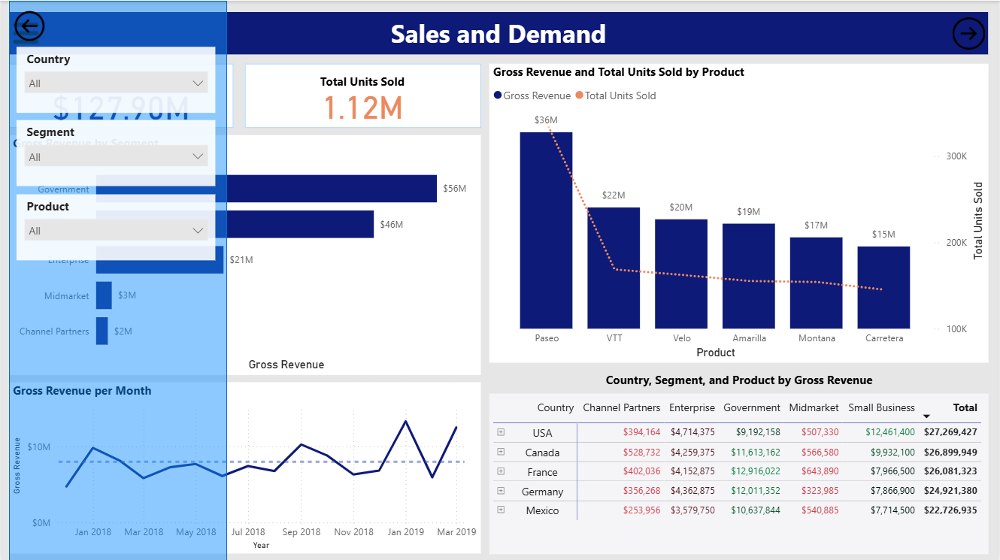
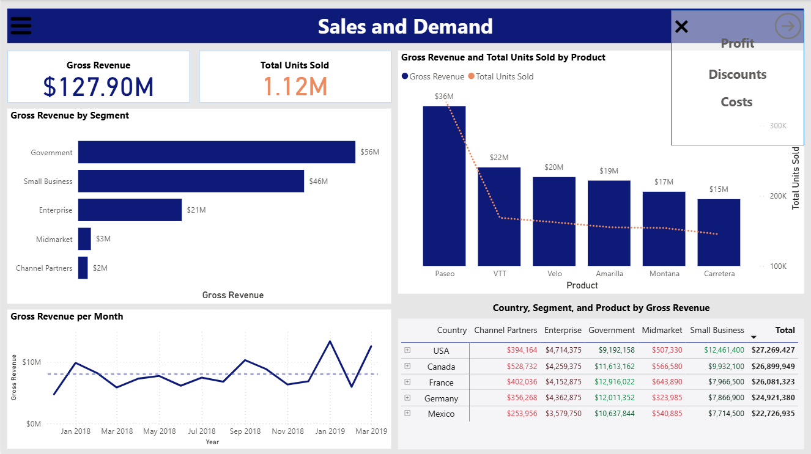
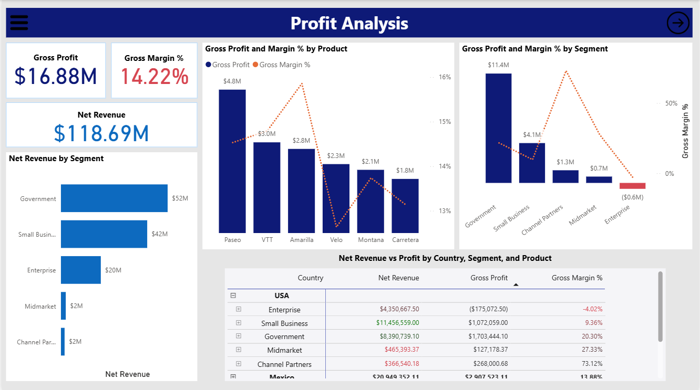
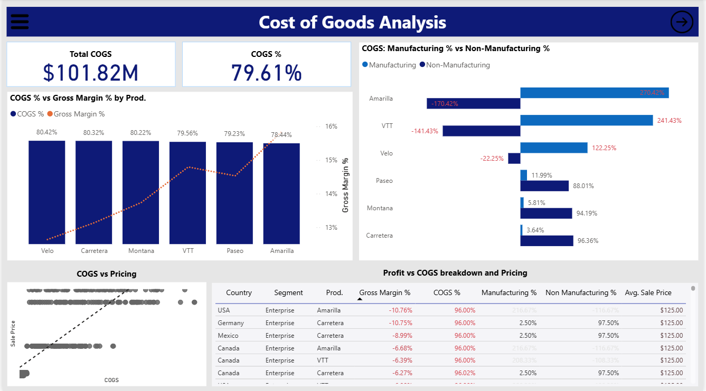
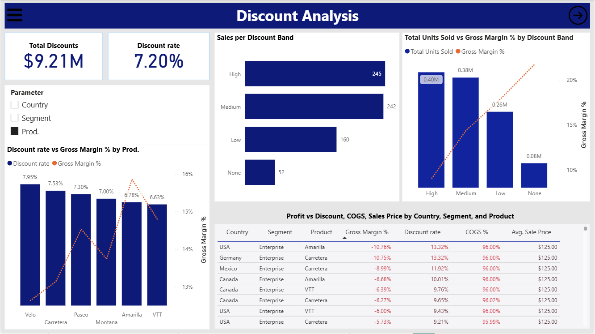

# Sales-analysis-dashboard

## Introduction

This Power BI project analyzes company sales performance across products, customer segments, and countries.
The goal is to uncover patterns in sales demand, profitability efficiency, and the impact of discounts and costs on profit margins.

## Analysis Goals

## Data Overview
The dataset represents transactional-level sales records across multiple product lines, customer segments, and countries.

- **Segment:** Customer category based on business type or size (Government, Small Business, Enterprise, Midmarket, Channel Partners).

- **Country:** The market where sales occurred.

- **Product:** Product sold.

- **Discount Band:** The qualitative range of discount applied (Low, Medium, High).

- **Units Sold:** Number of product units sold in each transaction or record.

- **Manufacturing Price:** The standard per-unit production cost for the product.

- **Sale Price:** The per-unit selling price before any discounts.

- **Discounts:** The amount of discount applied to the sale.

- **COGS:** Cost of Goods Sold - the total cost directly associated with production and sales of goods.

- **Date:** Transaction date.

## Data Preparation

### Cleaning and Transformation

- **Formatted currency columns:** Changed data type of all monetary fields (Sale Price, Manufacturing Price, COGS) to Decimal Number and added the Dollar ($) currency format for consistency.
- **Date column:** Converted the Date field from Text to Date data type to enable accurate time-based operations.
- **Handled missing values:** Identified missing values in the Discount column; confirmed they corresponded to the ‘None’ discount band and replaced them with 0 to ensure correct revenue and profit calculations.
- **Removed duplicate records:** Checked for and deleted duplicate transaction entries to maintain data accuracy.
- **Renamed some country values:** Renamed “United States” to “USA” for better readability on visuals.
- Added an ID column for easier reference and indexing.

### Calculated Metrics
I created measures to align with the key analysis goals defined earlier.
- **Gross Revenue –** total revenue before discounts.
- **Net Revenue –** revenue after accounting for discounts.
- **Gross Profit –** difference between net revenue and cost of goods sold (COGS).
- **Gross Margin % –** proportion of gross profit to net revenue.
- **Total COGS –** sum of manufacturing and non-manufacturing costs.
- **COGS % –** share of cost of goods sold relative to net revenue.
- **Manufacturing Cost –** total manufacturing price.
- **Manufacturing Cost % –** proportion of manufacturing cost relative to COGS.
- **Non-Manufacturing Cost –** other operational costs derived from subtracting manufacturing cost from COGS.
- **Non-Manufacturing Cost % –** proportion of non-manufacturing cost relative to COGS.
- **Discount Rate –** proportion of discount relative to gross revenue.

### Notes
From EDA, I noted that: 
Identified 16 unique dates, representing one per month - suggesting deliveries or sales may have been done or recorded monthly.
The dataset spans December 2017 to March 2019.
- 2017 includes only December.
- 2018 is the only complete year.
- 2019 includes January–March.
Due to this, time-series analyses would be limited.

## Analysis

### Dashboard

#### Page 1: Sales and demand

The Sales and Demand page provides a view of market demand across products, segments, and countries.
It helps understand which customer segments, markets, and products drive the most sales, as well as monthly sales trends.

The page allows users to:
- **KPIs:** View potential revenue from gross sales and total units sold, providing a quick snapshot of business scale and demand volume.
- **Revenue per Segment:** Compare gross revenue by segment to identify the most active and profitable customer groups.
- **Product Revenue and Units Sold:** See how much revenue each product generates while comparing it with the number of units sold per product — enabling evaluation of product-level performance in terms of both sales value and demand.
- **Monthly Revenue Trends:** View the distribution of gross revenue per month, identifying periods where performance was significantly above or below average. This helps track seasonality and demand cycles over time.
- **Country-Level Revenue Patterns:** A table provides an overview of gross revenue per country, broken down by segment and further by product. This reveals underlying patterns in how different customer segments and products contribute to each country’s total sales.

#### Controls

On each page, we have a menu icon, which when clicked on, reveals a sidebar with slicers allowing one to slice the page visuals by Product, Segment, or Country.

We also have a button on the top right through which we can easily navigate to other pages of the report.

#### Page 2: Profitability

While the Sales and Demand page reveals market potential, this page shifts focus to profitability. It evaluates how much money the company actually makes after accounting for discounts and costs, and whether high sales value is translating into sustainable profit.

Looking only at gross sales can create a false sense of success; this page provides a true reflection of financial performance, helping identify where revenue is strong but margins are weak and where cost or pricing strategies may need adjustment.

The page allows users to:
**KPIs:** 
  - **Net Revenue –** Actual money made from sales after discounts.

  - **Gross Profit –** The earnings remaining after deducting the cost of goods sold (COGS).

  - **Gross Margin % –** The proportion of profit retained from net revenue, showing efficiency and pricing strength.

**Net Revenue by Segment:** View how much actual revenue each customer segment contributes after discounts.
**Gross Profit and Margin % by Product:** Compare profitability across products, highlighting not only the value of the profits, but the actual profitability through the margin %.
**Gross Profit and Margin % by Segment:** Compare profitability across customer segments, highlighting which customer groups are cost-efficient or heavily discounted.
**Net Revenue vs. Profit Table:** Compare Net Revenue, Gross Profit, and Gross Margin % across countries, segments, and products to easily identify instances where high sales volume does not translate into profitability.
It is sorted by Gross Margin % to help pinpoint underperforming areas.

#### Page 3: Cost of Goods

This page helps us understand the Costs of Goods involved. By comparing COGS to margins, manufacturing, and pricing, we can identify opportunities to reduce costs, adjust pricing, or optimize operations to improve profit margins.

The page allows users to:
**KPIs:**

  - **Total COGS –** Total Cost of Goods incurred across all sales.

  - **COGS % –** COGS as a percentage of Gross revenue (Note: COGS% is measured against gross revenue rather than net revenue to avoid distortion from discounts.)
**COGS% vs Gross Margin% by Prodcut:** Allows users to compare product cost intensity vs profitability.
Reveals products where high COGS correspond to low margins, highlighting efficiency or pricing challenges.
**Manufacturing vs non manufacturing % per product:** Compare the proportion of COGS related to manufacturing and non-manufacturing costs per product.
**COGS vs Pricing:** Shows the relationship between COGS and pricing. Helps identify cases where high costs don’t translate to proportionately higher prices
**Profit vs COGS breakdown and pricing table:**
Enables detailed comparison of Gross Margin %, COGS %, manufacturing and non-manufacturing components, and average selling price.
Sorted from lowest to highest Gross Margin %, allowing users to quickly pinpoint loss-making or underperforming combinations (by country, segment, and product).
Supports strategic evaluation of whether cost efficiency or pricing adjustments can drive better margins.

#### Page 4: Discounts 
On this page, we get to see the impact of discounts on sales as well as profits and identify areas where a good balance needs to be striked such that profitability is not negatively affected.

> To interact with the actual dashboard, refer to the Power BI dashboard file: [Dashboard](https://github.com/MaureenMbugua/Sales-analysis-dashboard/blob/main/Sales_dashboard.pbix)

